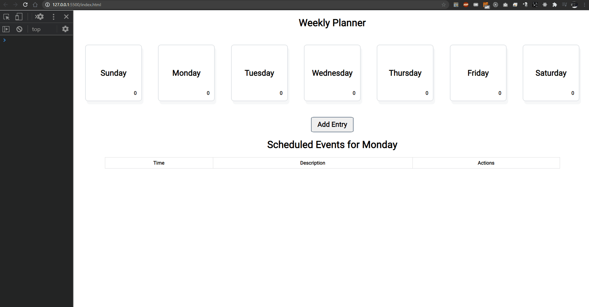

# week-planner
A typescript object oriented web application to plan your week

Responsive design suited for mobile and desktop

## Technologies Used

- Typescript

## Live Demo

Try the application live at [https://week-planner.uzairashraf.dev/](https://week-planner.uzairashraf.dev/)

## Features

- User can view daily planner
- User can add entry
- User can delete entry
- User can update entry
- User can view count of entries on day
- Data persists in Local Storage


## Preview




## Development

#### System Requirements

- NPM 6 or higher
- Node 10 or higher

  To install typescript tools run:

  ```shell
  npm install -g typescript
  ```

  According to the documentation Visual Studio 2015 and Visual Studio 2013 Update 2 include TypeScript by default

#### Getting Started

1. Clone the repository.

    ```shell
    git clone https://github.com/uzair-ashraf/week-planner.git
    cd week-planner
    ```

1. Install all dependencies with NPM.

    ```shell
    npm install
    ```

1. Run typescript compiler.

    ```shell
    npm start
    ```

    During development the watch command comes in handy.

    ```shell
    npm run dev
    ```

    This will recompile your code anytime your file system changes.


1. Open `index.html`.
